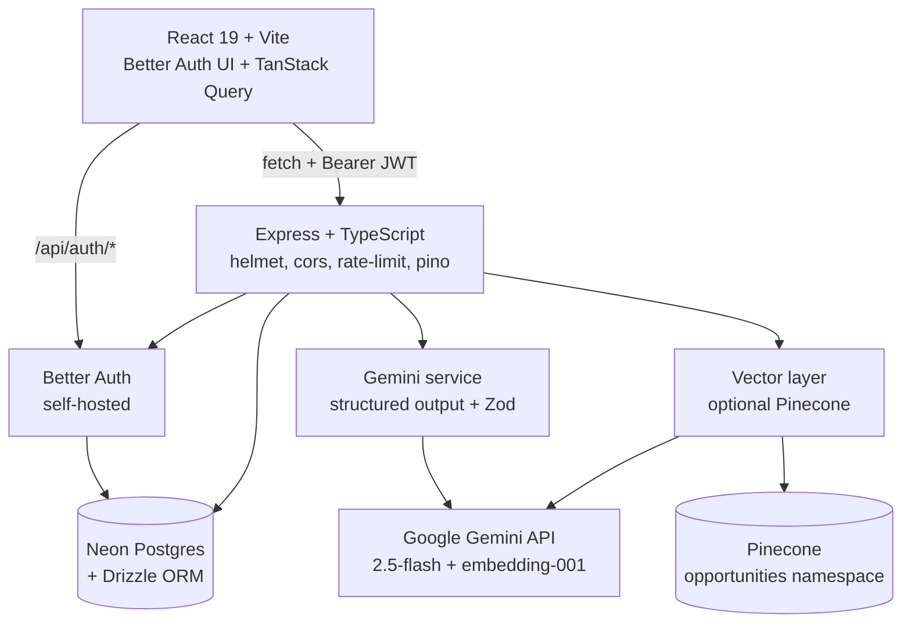
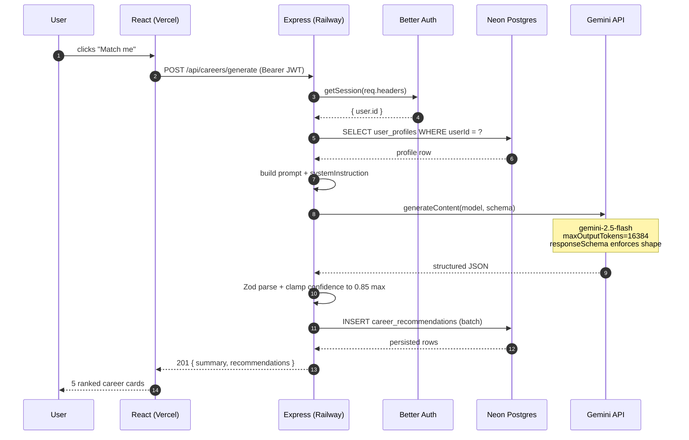
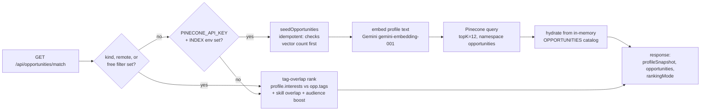
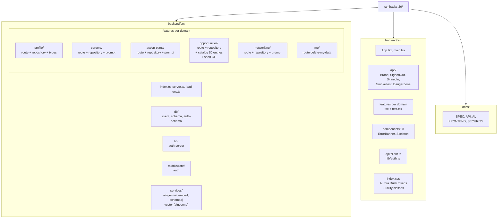

# AI Career & Opportunity Matcher

Personalized career-discovery platform for students, career switchers, and underrepresented talent. Profile in → AI-personalized career matches, ranked fellowship/internship opportunities, and a 7d / 30d / 90d / 6mo / long-term action plan + outreach drafts out.

> Built for **RamHacks 2026**. **Live demo:** https://ramhacks-26.vercel.app · **API health:** https://ramhacks-26-production.up.railway.app/api/health

**Status:** every milestone in [`docs/SPEC.md`](./docs/SPEC.md) shipped (M0 → M8 inclusive of both stretches). 16 smoke tests passing.

---

## What it does

| Feature | What you get |
|---|---|
| **Career matcher** | Click "Match me" → 3-5 ranked career paths, each with fit reasoning, required vs missing skills, suggested portfolio projects, entry roles, growth path, difficulty + confidence |
| **Opportunity recommender** | 50-entry curated catalog of fellowships / internships / scholarships / programs / bootcamps / communities / competitions, ranked by Pinecone semantic match (with SQL tag-overlap fallback). Filter by kind, remote, free, saved |
| **Action plan** | Five horizons — 7d / 30d / 90d / 6mo / long-term — with action, why, est. hours, difficulty, expected outcome, success criteria |
| **Networking generator** | Channel-aware outreach drafts (LinkedIn DM, email, Twitter, in-person), 5 tone options, alternatives + follow-ups + meeting questions, copy-to-clipboard |
| **Save + delete-my-data** | Star anything to keep it; one-click `DELETE /api/me` wipes your profile + all derived data while preserving your sign-in account |

---

## Architecture



**Stack**

| Layer | Choice | Why |
|---|---|---|
| Frontend | React 19 + Vite + TypeScript + react-router-dom + TanStack Query | Familiar, fast HMR, code-splitting via `React.lazy` |
| Auth | Self-hosted Better Auth (Plan C) with `bearer` + `jwt` plugins | Started with Neon Auth's hosted UI, hit `INVALID_ORIGIN` we couldn't fix upstream — switched to self-hosted, kept the same `neon_auth.*` schema |
| Backend | Express + TypeScript, layered: `features/<domain>/{route,repository,prompt}.ts` | Predictable shape, every feature is self-contained |
| DB | Neon Postgres + Drizzle ORM | Serverless Postgres, parameterized queries, painless migrations |
| AI | Google Gemini 2.5-flash via `@google/genai`, with auto-discovery + tier-sorted fallback chain | Structured output (`responseMimeType: application/json` + `responseSchema`) eliminates a whole class of parsing bugs |
| Vector | Pinecone (optional) + Gemini `gemini-embedding-001` (1024-dim via Matryoshka truncation) | Catalog matches use cosine similarity over profile embeddings; falls back to SQL tag-overlap if Pinecone is down or unconfigured |
| Tests | Vitest + @testing-library/react + jsdom | 16 smoke tests, ~10s |
| Deploy | Railway (backend) + Vercel (frontend) | Railway for no cold starts, Vercel for SPA + edge headers |

---

## "Match me" — what happens when you click



If Gemini truncates mid-JSON, the route falls through the model chain (`2.5-flash` → `2.0-flash` → `1.5-flash`) and surfaces a 503 `ai_unavailable` only when every model fails.

---

## Opportunity match — vector path with graceful fallback



`rankingMode` is included in the response so the UI / dev tools can tell which path served the result.

---

## Local development

### Prerequisites

- **Node 20+** (tested on 25.x)
- A **Neon project** with **Auth enabled** (provisions `neon_auth.{user,session,account,verification,jwks}`)
- A **Gemini API key** ([aistudio.google.com](https://aistudio.google.com))
- **(Optional)** A **Pinecone** serverless index named `careers-mvp`, dim **1024**, metric **cosine**

### Quickstart

```bash
git clone https://github.com/<you>/ramhacks-26
cd ramhacks-26

npm run install:all          # installs root + backend + frontend

cp .env.example .env         # then fill in DATABASE_URL, BETTER_AUTH_SECRET,
                             # VITE_NEON_AUTH_URL, GEMINI_API_KEY, etc.

cd backend && npm run db:push && cd ..   # apply Drizzle schema to Neon

npm run dev                  # backend:4000 + frontend:5173 in parallel
```

Open `http://localhost:5173` → sign up → fill onboarding → click **Match me** → click **Plan my next steps** → draft an outreach message.

### Useful scripts

| Where | Command | Does |
|---|---|---|
| root | `npm run dev` | both apps via `concurrently` |
| root | `npm run build` | both production builds |
| backend | `npm run db:generate -- --name <name>` | generate a new Drizzle migration |
| backend | `npm run db:push` | apply pending migrations to Neon |
| backend | `npm run seed:vectors` | embed + upsert all 50 catalog entries to Pinecone |
| frontend | `npm test` | Vitest run (16 smoke tests, ~10s) |
| frontend | `npm run test:watch` | interactive watch mode |

---

## Project layout



**Conventions**
- Cross-folder imports use `@/` aliases (`tsc-alias` rewrites for the backend `dist/`); sibling imports stay relative.
- Each backend feature is **self-contained**: `route.ts` + `repository.ts` + `prompt.ts` (when AI-backed) + `types.ts` (when shared with the route handler).
- Each frontend feature owns its own `*.tsx` panel + a colocated `*.test.tsx` smoke test.

---

## Testing

Vitest + @testing-library/react + jsdom. Mocks `@/api/client` per test.

```
$ npm --prefix frontend test

 ✓ src/components/ui/ErrorBanner.test.tsx                    (3 tests)
 ✓ src/components/ui/Skeleton.test.tsx                       (3 tests)
 ✓ src/features/opportunities/OpportunityList.test.tsx       (2 tests)
 ✓ src/features/careers/CareerMatches.test.tsx               (2 tests)
 ✓ src/features/action-plans/ActionPlanPanel.test.tsx        (2 tests)
 ✓ src/features/networking/NetworkingPanel.test.tsx          (2 tests)
 ✓ src/features/onboarding/OnboardingForm.test.tsx           (2 tests)

 Test Files  7 passed (7)
      Tests  16 passed (16)
```

Each panel test covers: render-doesn't-crash + happy-path data assertion (mocked `api.get` / `api.post` returning canned responses).

---

## Deploy

Two services. **Railway** for the backend (no cold starts, ~30 s deploys), **Vercel** for the frontend.

### Backend → Railway

1. Push to GitHub.
2. https://railway.com/new → **Deploy from GitHub repo** → pick this repo. Railway reads `backend/railway.json`.
3. Set **Root directory** = `backend` in Settings → Source.
4. **Variables** tab — required:
   ```
   NODE_ENV=production
   DATABASE_URL=<Neon pooled URL>
   BETTER_AUTH_SECRET=<32+ chars; openssl rand -hex 32>
   GEMINI_API_KEY=<aistudio.google.com>
   GEMINI_MODEL=gemini-2.5-flash
   GEMINI_EMBED_MODEL=gemini-embedding-001
   GEMINI_EMBED_DIM=1024            # Matryoshka truncation to match Pinecone
   PINECONE_API_KEY=<optional>
   PINECONE_INDEX=careers-mvp        # optional
   CORS_ORIGIN=https://<your-vercel-domain>
   ```
5. Settings → **Networking → Generate Domain**. You'll get something like `ramhacks-26-production.up.railway.app`.
6. Auto-deploys on push to `master`. ~30 s build (`tsc && tsc-alias`).

### Frontend → Vercel

1. https://vercel.com/new → import the same GitHub repo.
2. Root directory = `frontend`. Vercel auto-detects Vite + reads `frontend/vercel.json` for the SPA rewrite + security headers.
3. Environment variables:
   ```
   VITE_API_BASE_URL=https://<your-railway-domain>
   ```
4. Deploy. ~1 min build.

### Smoke-test prod

```bash
curl https://<RAILWAY>/api/health
# → {"ok":true,"ts":"2026-..."}

curl -i https://<RAILWAY>/api/profile
# → 401 (auth gate works, route exists)
```

---

## Security posture

Validated against the OWASP top 10 + a comprehensive checklist. Highlights:

- **Helmet** (HSTS, X-Content-Type-Options, frame-ancestors) + **CORS** (single trusted origin) + **Rate limit** on `/api/*` (240 req/min/IP) and per-user AI endpoints (6-10 req/min).
- **Better Auth `customRules`**: `/sign-in/email` 5/min · `/sign-up/email` 5/min · `/forget-password` 3/min — credential-stuffing rejected before DB.
- **Vercel-side CSP**: `script-src 'self'` · `connect-src 'self' <backend>` · `object-src 'none'` · `frame-ancestors 'none'` + Permissions-Policy + HSTS preload.
- **All routes** under `requireAuth` middleware; **every** repository query scopes by `userId`.
- **Drizzle** for all SQL — zero raw concatenation, parameterized only.
- **pino redaction** on `authorization`, `cookie`, `password`, `email`, `token`, `secret`, `set-cookie` headers/body fields.
- **Production error responses** strip `details`; full errors only in server logs.
- **`npm audit --omit=dev`**: 0 vulnerabilities (both packages).

Full checklist in [`docs/SECURITY.md`](./docs/SECURITY.md).

---

## Milestones (M0 → M8)

| # | Title | Status |
|---|---|---|
| **M0** | Bootstrap (concurrently, Neon Auth, Pinecone index, Gemini key) | ✅ |
| **M1** | Auth + onboarding (Better Auth + Drizzle + onboarding form) | ✅ |
| **M2** | Career matcher (`POST /api/careers/generate` + cards) | ✅ |
| **M3** | Opportunity recommender (50-entry catalog + match endpoint + UI) | ✅ |
| **M4** | Action plan (5-horizon generator + page) | ✅ |
| **M5** | Save + settings (save/unsave + saved-only + delete-my-data) | ✅ |
| **M6** | Polish + deploy (skeletons, error banner, dev-tool gating, live URLs) | ✅ |
| **M7** *(stretch)* | Networking generator (channel-aware drafts + tones) | ✅ |
| **M8** *(stretch)* | Pinecone semantic match (with SQL fallback) | ✅ |

---

## Docs

Deep design + reference:

- [`docs/SPEC.md`](./docs/SPEC.md) — product vision, target users, milestones
- [`docs/API.md`](./docs/API.md) — every endpoint with request/response shapes
- [`docs/AI.md`](./docs/AI.md) — prompt structure, Zod schemas, fallback strategy
- [`docs/FRONTEND.md`](./docs/FRONTEND.md) — component tree + state management
- [`docs/SECURITY.md`](./docs/SECURITY.md) — threat model, mitigations, env hygiene

---

## License

Apache-2.0 — see [LICENSE](./LICENSE) (add before public release).

🤖 Built with help from Claude Code.
